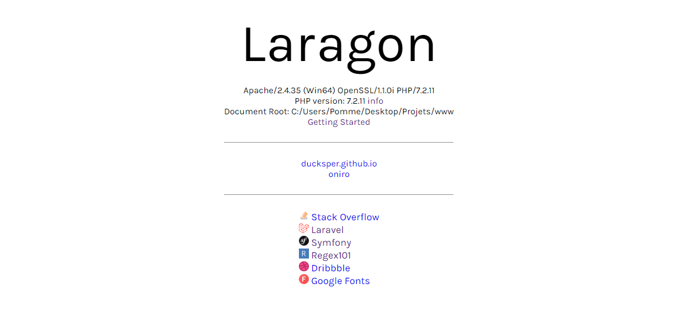

<h1 align="center">Laragon Homepage v2</h1>

<b>Laragon Homepage v2</b> is a replacement page to the original one. It displays the <b>projects in progress</b>, it is <b>light</b> and <b>one-file</b>.

### Installation
1. Rename the file `index.php` to `index.old.php` to get a backup if needed,
2. Place the file `index.php` in your `www` folder.

### License

This project is under the MIT License. See the [LICENSE](https://github.com/esimov/triangle/blob/master/LICENSE) file for the full license text.
